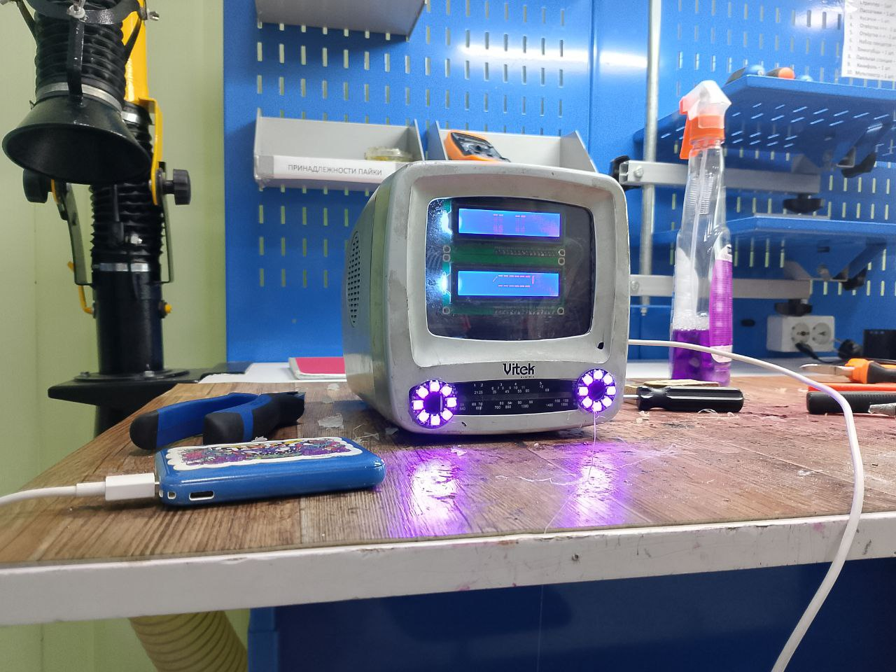

# Музыкальный проигрыватель на базе Arduino Nano “Витёк”

> "Витёк" — это компактный и функциональный музыкальный проигрыватель, собранный на базе Arduino Nano. Устройство позволяет воспроизводить аудиофайлы (в форматах MP3) с SD-карты.

> ## Пример

> В конце я хотел бы попросить вас поставить ⭐ на этот репозиторий!
